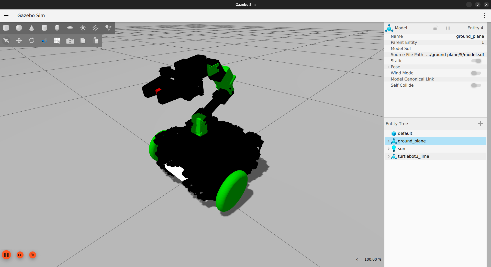
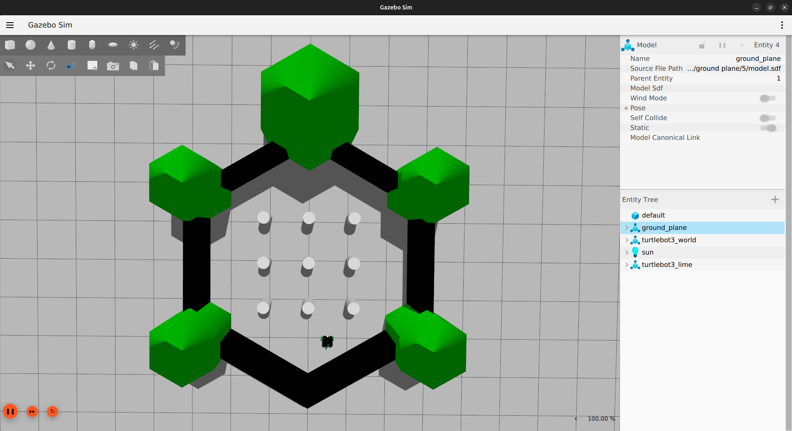
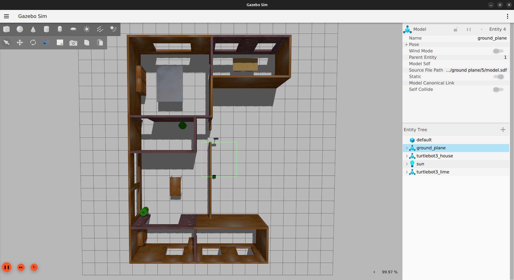

# TurtleBot3 Friends: Lime


## Gazebo 環境での動作検証

|                     Gazebo 環境 + Rviz                     |
| :--------------------------------------------------------: |
|  |

## サポート状況

各機能のサポート状況を以下に示します．

- ✓ : 利用可能
- ? : 未確認
- X : 利用不可

### 実機

|     機能     | Humble | Jazzy |
| :----------: | :----: | :---: |
|    Teleop    |   ?    |   ?   |
|     SLAM     |   ?    |   ?   |
|  Navigation  |   ?    |   ?   |
| Manipulation |   ?    |   ?   |

### Gazebo シミュレーション

|     機能     | Humble | Jazzy |
| :----------: | :----: | :---: |
|    Teleop    |   ✓    |   ✓   |
|     SLAM     |   ✓    |   ✓   |
|  Navigation  |   ✓    |   ✓   |
| Manipulation |   ✓    |   ✓   |

> [!WARNING]
> ROS 2 Humble で使用する Gazebo Fortress では，`ODE` 物理エンジンの動作が不安定になる場合があります．
> また，ROS 2 Humble の `ros_gz_bridge` および `ros_gz_image_bridge` では，`QoS` の上書きや `lazy` 設定を利用できません．
> そのため，Gazebo シミュレーションを利用する場合は **ROS 2 Jazzy を推奨します**．

## セットアップ手順（Quick Start Guide）

Lime のベースである [TurtleBot3 with OpenMANIPULATOR](https://emanual.robotis.com/docs/en/platform/turtlebot3/manipulation/) から変更点があります．以下の手順を参考にしてください．

### 1. PC セットアップ

> [!WARNING]
> この章の内容は，TurtleBot3の制御に使用するリモート PC（デスクトップ PC またはノート PC）の初期設定に関するものです．TurtleBot3 Lime 本体上でこれらの手順を実行しないでください．

#### 1.1. Ubuntu のインストール

1. 以下のリンクから，お使いの PC 用の Ubuntu 22.04 / 24.04 LTS デスクトップイメージをダウンロードしてください．
   - [Ubuntu 22.04 LTS Desktop image (64-bit)](https://releases.ubuntu.com/22.04/)
   - [Ubuntu 24.04 LTS Desktop image (64-bit)](https://releases.ubuntu.com/noble/)

2. Ubuntu をインストールするには，以下の手順に従ってください．
   - [Install Ubuntu desktop](https://ubuntu.com/tutorials/install-ubuntu-desktop#1-overview)

#### 1.2. ROS 2 のインストール

使用する Ubuntu のバージョンに応じて，ROS 2 Desktop をインストールしてください．

- Ubuntu 22.04 LTS : [ROS 2 Humble installation guide](https://docs.ros.org/en/humble/Installation/Ubuntu-Install-Debs.html)
- Ubuntu 24.04 LTS : [ROS 2 Jazzy installation guide](https://docs.ros.org/en/jazzy/Installation/Ubuntu-Install-Debs.html)

#### 1.3. ROS パッケージ のインストールおよびビルド

1. `Ctrl` + `Alt` + `T` を押してターミナルを開きます．

2. ROS パッケージ のインストールおよびビルドを行います．

   **[Remote PC]**

   ```bash
   sudo apt update
   sudo apt install -y \
     python3-pip \
     python3-argcomplete \
     python3-colcon-common-extensions \
     python3-rosdep \
     libboost-system-dev \
     build-essential
   sudo apt install -y \
     ros-${ROS_DISTRO}-realsense2-camera-msgs \
     ros-${ROS_DISTRO}-realsense2-description

   mkdir -p ~/turtlebot3_ws/src && cd ~/turtlebot3_ws/src
   git clone -b ${ROS_DISTRO} https://github.com//turtlebot3_lime.git

   echo 'source /opt/ros/${ROS_DISTRO}/setup.bash' >> ~/.bashrc
   source ~/.bashrc

   sudo rosdep init
   rosdep update

   cd ~/turtlebot3_ws/
   colcon build --symlink-install
   ```

### 2. SBC セットアップ

#### 2.1. JetPack のインストール

Turtlebot3 Lime を利用するには，Jetson Orin Nano に Jetpack 6.x をインストールする必要があります．

1. Ubuntu 22.04 / 24.04 がインストールされた PC（以下，リモート PC）を用意してください．
2. [SDK Manager](https://developer.nvidia.com/sdk-manager) をインストールしてください．
3. [公式のインストールガイド](https://docs.nvidia.com/sdk-manager/install-with-sdkm-jetson/index.html) に従って，Jetpack 6.x をインストールしてください．

#### 2.2. Jetson Orin Nano の起動

> [!NOTE]
> HDMI，電源，入力デバイスなどの接続場所については，Jetson Orin Nano Developer Kit のドキュメントを参照してください．

- DisplayPort ケーブルを Jetson Orin Nano の DisplayPort に接続し，ディスプレイと接続します．
- 入力デバイス（通常はキーボードとマウス）を Jetson Orin Nano の USB ポートに接続します．
- OpenCR を Jetson Orin Nano の USB ポートに接続します．
- DC 電源を接続し，Jetson Orin Nano の電源を入れます．
- 起動後，設定したユーザー名とパスワードを入力して Ubuntu にログインします．

#### 2.3. パワーモードとヘッドレスモードの切り替え

1. `Ctrl` + `Alt` + `T` で端末を起動
2. パワーモードを `MAXN SUPER` に設定します．

   **[TurtleBot3 Lime SBC]**

   ```bash
   sudo nvpmodel -m 2
   ```

3. GUI 自動起動を停止します．

   **[TurtleBot3 Lime SBC]**

   ```bash
   sudo systemctl set-default multi-user.target
   ```

#### 2.3. Jetson Orin Nano の設定

1. APT の自動更新を無効にします．

   **[TurtleBot3 Lime SBC]**

   ```bash
   sudo tee /etc/apt/apt.conf.d/20auto-upgrades > /dev/null <<'EOF'
   APT::Periodic::Update-Package-Lists "0";
   APT::Periodic::Unattended-Upgrade "0";
   EOF
   ```

2. 起動時のネットワーク接続待機を無効にします．

   **[TurtleBot3 Lime SBC]**

   ```bash
   systemctl mask systemd-networkd-wait-online.service
   ```

3. サスペンドとハイバネーションを無効にします．

   **[TurtleBot3 Lime SBC]**

   ```bash
   sudo systemctl mask sleep.target suspend.target hibernate.target hybrid-sleep.target
   ```

4. IP アドレスを確認します（SSH 接続時に利用）．

   **[TurtleBot3 Lime SBC]**

   ```bash
   ip a
   ```

5. 再起動します．

   **[TurtleBot3 Lime SBC]**

   ```bash
   reboot
   ```

#### 2.4. SSH 接続

リモート PC から SBC に SSH 接続します．

**[Remote PC]**

```bash
ssh {Login Name}@{IP Address of Jetson Orin Nano}
```

以降は，リモート PC から Jetson Orin Nano を操作します．

#### 2.5. ROS 2 のインストール

使用する Ubuntu のバージョンに応じて，ROS 2 Desktop をインストールします．

- Ubuntu 22.04 LTS : [ROS 2 Humble installation guide](https://docs.ros.org/en/humble/Installation/Ubuntu-Install-Debs.html)
- Ubuntu 24.04 LTS : [ROS 2 Jazzy installation guide](https://docs.ros.org/en/jazzy/Installation/Ubuntu-Install-Debs.html)

#### 2.6 Intel RealSense SDK 2.0 のインストール

Intel RealSense SDK 2.0 で CUDA を有効化するために，ソースからビルドしてインストールします．

**[TurtleBot3 Lime SBC]**

```bash
sudo apt update
sudo apt install -y git libssl-dev libusb-1.0-0-dev pkg-config libgtk-3-dev
cd ~/Downloads/
git clone https://github.com/IntelRealSense/librealsense.git -b v2.55.1
cd ./librealsense/
sudo cp config/99-realsense-libusb.rules /etc/udev/rules.d/
sudo cp config/99-realsense-d4xx-mipi-dfu.rules /etc/udev/rules.d/
sudo udevadm control --reload-rules && sudo udevadm trigger
mkdir build && cd build
cmake .. -DBUILD_EXAMPLES=true -DCMAKE_BUILD_TYPE=release -DFORCE_RSUSB_BACKEND=true -DBUILD_WITH_CUDA=true && make -j$(($(nproc)-1)) && sudo make install
```

#### 2.7 Realsense D435i のセットアップ

Realsense D435i 内部のファームウェアのバージョンを Intel RealSense SDK 2.0 のバージョンと合わせる必要があります．

[Realsense 公式サイト](https://dev.realsenseai.com/docs/firmware-releases-d400/)から，
Version-5.16.0.1 を `Downloads` フォルダにダウンロードしてください．

Realsense D435i内臓ファームウェアを Jetson Orin Nano から書き込みます．

**[TurtleBot3 Lime SBC]**

```bash
cd ~/Downloads/
unzip ./Signed_Image_UVC_5_16_0_1.zip
rs-fw-update -f ./Signed_Image_UVC_5_16_0_1.bin
```

#### 2.8. ROS パッケージ のインストールとビルド

**[TurtleBot3 Lime SBC]**

```bash
sudo apt update
sudo apt install -y \
  python3-pip \
  python3-argcomplete \
  python3-colcon-common-extensions \
  python3-rosdep \
  libboost-system-dev \
  build-essential
mkdir -p ~/turtlebot3_ws/src && cd ~/turtlebot3_ws/src
git clone -b ${ROS_DISTRO} https://github.com//turtlebot3_lime.git
git clone https://github.com/IntelRealSense/realsense-ros -b 4.55.1
cd ~/turtlebot3_ws/src/turtlebot3_lime
cd ~/turtlebot3_ws/
echo 'source /opt/ros/${ROS_DISTRO}/setup.bash' >> ~/.bashrc
source ~/.bashrc
sudo rosdep init
rosdep update

rosdep install \
  --from-paths src \
  --ignore-src \
  --skip-keys "turtlebot3_lime turtlebot3_lime_cartographer turtlebot3_lime_navigation2 turtlebot3_lime_gazebo turtlebot3_lime_moveit_config" \
  -r -y

colcon build \
  --symlink-install \
  --parallel-workers 1 \
  --packages-skip \
  turtlebot3_lime \
  turtlebot3_lime_cartographer \
  turtlebot3_lime_navigation2 \
  turtlebot3_lime_gazebo \
  turtlebot3_lime_moveit_config

echo '[ -f ~/turtlebot3_ws/install/setup.bash ] && source ~/turtlebot3_ws/install/setup.bash' >> ~/.bashrc
source ~/.bashrc
```

#### 2.9 OpenCR のための USB Port 設定

**[TurtleBot3 Lime SBC]**

```bash
sudo curl -fsSL \
  https://raw.githubusercontent.com/ROBOTIS-GIT/turtlebot3/main/turtlebot3_bringup/script/99-turtlebot3-cdc.rules \
  -o /etc/udev/rules.d/99-turtlebot3-cdc.rules

sudo udevadm control --reload-rules
sudo udevadm trigger
```

#### 2.10. OpenCR のセットアップ

OpenCR を Jetson Orin Nano を通して，セットアップを行います．

**[TurtleBot3 Lime SBC]**

```bash
sudo dpkg --add-architecture armhf
sudo apt update
sudo apt install -y libc6:armhf
export OPENCR_PORT=/dev/ttyACM0
export OPENCR_MODEL=lime
cd ~/Downloads/
rm -rf ./opencr_update.tar.bz2
wget https://github.com/ROBOTIS-JAPAN-GIT/OpenCR_jp_custom/releases/download/ros2v1.0.1/opencr_update_jp_custom.tar.bz2
tar -xvf opencr_update_jp_custom.tar.bz2
cd ./opencr_update
./update.sh $OPENCR_PORT $OPENCR_MODEL.opencr
```

#### 2.11. ROS_DOMAIN_ID の設定

SBC の `ROS_DOMAIN_ID` を `30` に設定します．

**[TurtleBot3 Lime SBC]**

echo 'export ROS_DOMAIN_ID=30 # TURTLEBOT3' >> ~/.bashrc
source ~/.bashrc

> [!WARNING]
> 同一ネットワーク内で，他のユーザーと同一の `ROS_DOMAIN_ID` を使用しないでください．同一ネットワーク環境下にあるユーザー間で通信の競合が発生する原因となります．

### 3. 実機での操作

#### 3.1. 実機の起動

> [!IMPORTANT]
> Jetson Orin Nano とリモート PC の時刻を必ず同期してください．両方をインターネットに接続することで，時刻を同期できます．

1. リモート PC で `Ctrl` + `Alt` + `T` を押してターミナルを開きます．

2. Jetson Orin Nano へ SSH 接続して，TurtleBot3 Lime の基本的な機能を使用するために必要なパッケージを起動します．

   **[Remote PC]**

   ```bash
   ssh {Login Name}@{IP Address of Jetson Orin Nano}
   ```

   **[TurtleBot3 Lime SBC]**

   ```bash
   ros2 launch turtlebot3_lime_bringup hardware.launch.py
   ```

3. Jetson Orin Nano へ SSH 接続して，RealSense D435i のドライバを起動します．
   - `Ctrl` + `Shift` + `T` を押してターミナルの新しいタブを開きます．

   - Jetson Orin Nano へ SSH 接続します．

     **[Remote PC]**

     ```bash
     ssh {Login Name}@{IP Address of Jetson Orin Nano}
     ```

   - RealSense D435i のドライバを起動します．

     **[TurtleBot3 Lime SBC]**

     ```bash
     ros2 launch realsense2_camera rs_launch.py \
       rgb_camera.color_profile:=640x480x30 \
       depth_module.depth_profile:=640x480x30 \
       align_depth.enable:=true
     ```

     Point Cloud を使用する場合は，`pointcloud.enable` を `true` にします．

     **[TurtleBot3 Lime SBC]**

     ```bash
     ros2 launch realsense2_camera rs_launch.py \
       rgb_camera.color_profile:=640x480x30 \
       depth_module.depth_profile:=640x480x30 \
       align_depth.enable:=true \
       pointcloud.enable:=true
     ```

4. リモート PC でターミナルの新しいタブを開き，MoveIt Servo を起動します．
   - `Ctrl` + `Shift` + `T` を押してターミナルの新しいタブを開きます．

   - MoveIt Servo を起動します．

     **[Remote PC]**

     ```bash
     ros2 launch turtlebot3_lime_moveit_config servo.launch.py
     ```

> [!IMPORTANT]
> MoveIt 2 の実行中は `hardware.launch.py` および `rs_launch.py` を終了しないでください．終了する場合は，先に MoveIt 2 を終了してください．

#### 3.2. 地図の作成（SLAM）

1. リモート PC で Cartographer を起動し，SLAM を開始します．
   - `Ctrl` + `Shift` + `T` を押してターミナルの新しいタブを開きます．

   - Cartographer を起動します．

     **[Remote PC]**

     ```bash
     ros2 launch turtlebot3_lime_cartographer cartographer.launch.py
     ```

2. リモート PC で Teleop を起動し，TurtleBot3 Lime を操作します．
   - `Ctrl` + `Shift` + `T` を押してターミナルの新しいタブを開きます．

   - Teleop を起動します．

     **[Remote PC]**

     ```bash
     ros2 run turtlebot3_lime_teleop turtlebot3_lime_teleop
     ```

   キーボードから以下の操作ができます．

   | Key       | Operation                      |
   | --------- | ------------------------------ |
   | `1` / `q` | Joint1 を正方向 / 負方向に回転 |
   | `2` / `w` | Joint2 を正方向 / 負方向に回転 |
   | `3` / `e` | Joint3 を正方向 / 負方向に回転 |
   | `4` / `r` | Joint4 を正方向 / 負方向に回転 |
   | `5` / `t` | Joint5 を正方向 / 負方向に回転 |
   | `6` / `y` | Joint6 を正方向 / 負方向に回転 |
   | `o` / `p` | グリッパーを開く / 閉じる      |
   | `i`       | TurtleBot3 を前進              |
   | `k`       | TurtleBot3 を後退              |
   | `j`       | TurtleBot3 を左旋回            |
   | `l`       | TurtleBot3 を右旋回            |
   | `Space`   | TurtleBot3 を停止              |
   | `Esc`     | Teleop を終了                  |

3. TurtleBot3 Lime を操作して周囲の地図を作成します．

4. 地図の作成が完了したら，リモート PC で地図を保存します．
   - `Ctrl` + `Shift` + `T` を押してターミナルの新しいタブを開きます．

   - 作成した地図を `~/map` に保存します．

     **[Remote PC]**

     ```bash
     ros2 run nav2_map_server map_saver_cli -f ~/map
     ```

#### 3.3. Navigation 2

1. リモート PC で Navigation 2 を起動します．
   - `Ctrl` + `Shift` + `T` を押してターミナルの新しいタブを開きます．

   - 「3.2. 地図の作成（SLAM）」で作成した地図を指定して，Navigation 2 を起動します．

     **[Remote PC]**

     ```bash
     ros2 launch turtlebot3_lime_navigation2 navigation2.launch.py \
       map_yaml_file:=$HOME/map.yaml
     ```

2. RViz2 の `2D Pose Estimate` を使用して，地図上で TurtleBot3 Lime の初期位置と姿勢を設定します．

3. RViz2 の `Nav2 Goal` を使用して，地図上で TurtleBot3 Lime の目標位置と姿勢を設定します．

   TurtleBot3 Lime が設定した目標位置まで自律移動します．

#### 3.4. MoveIt 2

> [!IMPORTANT]
> MoveIt 2 の実行中は `hardware.launch.py` および `rs_launch.py` を終了しないでください．終了する場合は，先に MoveIt 2 を終了してください．

1. リモート PC で Move Group と RViz2 を起動します．
   - `Ctrl` + `Shift` + `T` を押してターミナルの新しいタブを開きます．

   - Move Group と RViz2 を起動します．

     **[Remote PC]**

     ```bash
     ros2 launch turtlebot3_lime_moveit_config moveit_core.launch.py
     ```

2. RViz2 の `MotionPlanning` パネルを使用して，TurtleBot3 Lime のアームの目標姿勢を設定します．

3. `Plan` を実行して，目標姿勢までの軌道を生成します．

4. `Execute` を実行して，生成した軌道に従ってアームを動作させます．

#### 3.5. Navigation 2 と MoveIt 2 の同時実行

> [!IMPORTANT]
> Navigation 2 および MoveIt 2 の実行中は `hardware.launch.py` および `rs_launch.py` を終了しないでください．終了する場合は，先に Navigation 2 および MoveIt 2 を終了してください．

1. リモート PC で Navigation 2 と MoveIt 2 を起動します．
   - `Ctrl` + `Shift` + `T` を押してターミナルの新しいタブを開きます．

   - 「3.2. 地図の作成（SLAM）」で作成した地図を指定して，Navigation 2 と MoveIt 2 を起動します．

     **[Remote PC]**

     ```bash
     ros2 launch turtlebot3_lime_bringup moveit_navigation.launch.py \
       map_yaml_file:=$HOME/map.yaml
     ```

   Navigation 2 用と MoveIt 2 用の RViz2 がそれぞれ起動します．

2. Navigation 2 用の RViz2 で `2D Pose Estimate` を使用して，地図上で TurtleBot3 Lime の初期位置と姿勢を設定します．

3. Navigation 2 用の RViz2 で `Nav2 Goal` を使用して，TurtleBot3 Lime の目標位置と姿勢を設定します．

4. MoveIt 2 用の RViz2 の `MotionPlanning` パネルを使用して，TurtleBot3 Lime のアームの目標姿勢を設定します．

### 4. Fake Hardware での操作

Fake Hardware を使用すると，TurtleBot3 Lime の実機を使用せずに，リモート PC 上でロボットのハードウェアインターフェースを模擬できます．

> [!NOTE]
> Fake Hardware を使用する場合は，すべての操作をリモート PC で行います．

#### 4.1. Fake Hardware の起動

1. リモート PC で `Ctrl` + `Alt` + `T` を押してターミナルを開きます．

2. Fake Hardware を起動します．

   **[Remote PC]**

   ```bash
   ros2 launch turtlebot3_lime_bringup fake.launch.py
   ```

   Battery State および IMU も模擬する場合は，`fake_sensor_commands` を `true` にします．

   **[Remote PC]**

   ```bash
   ros2 launch turtlebot3_lime_bringup fake.launch.py \
     fake_sensor_commands:=true
   ```

3. リモート PC で MoveIt Servo を起動します．
   - `Ctrl` + `Shift` + `T` を押してターミナルの新しいタブを開きます．

   - MoveIt Servo を起動します．

     **[Remote PC]**

     ```bash
     ros2 launch turtlebot3_lime_moveit_config servo.launch.py \
       use_fake_hardware:=true
     ```

#### 4.2. MoveIt 2

1. リモート PC で Fake Hardware 用の Move Group と RViz2 を起動します．
   - `Ctrl` + `Shift` + `T` を押してターミナルの新しいタブを開きます．

   - Move Group と RViz2 を起動します．

     **[Remote PC]**

     ```bash
     ros2 launch turtlebot3_lime_moveit_config moveit_fake.launch.py
     ```

2. RViz2 の `MotionPlanning` パネルを使用して，TurtleBot3 Lime のアームの目標姿勢を設定します．

3. `Plan` を実行して，目標姿勢までの軌道を生成します．

4. `Execute` を実行して，生成した軌道に従って Fake Hardware 上のアームを動作させます．

### 5. シミュレーションでの操作

#### 5.1. Gazebo シミュレーション の起動

TurtleBot3 Lime 用に 3 つのシミュレーション環境が用意されています．

1. Gazebo シミュレーションの起動

   下記のうち，いずれか 1 つを選択して起動してください．
   - Empty World

     **[Remote PC]**

     ```bash
     ros2 launch turtlebot3_lime_gazebo empty_world.launch.py
     ```

     

   - TurtleBot3 World

     **[Remote PC]**

     ```bash
     ros2 launch turtlebot3_lime_gazebo turtlebot3_world.launch.py
     ```

     

   - TurtleBot3 House

     **[Remote PC]**

     ```bash
     ros2 launch turtlebot3_lime_gazebo turtlebot3_house.launch.py
     ```

     

2. MoveIt Servo を起動します．

   **[Remote PC]**

   ```bash
   ros2 launch turtlebot3_lime_moveit_config servo.launch.py use_sim_time:=true use_gazebo:=true
   ```

#### 5.2. 地図を作る (SLAM)


SLAM を立ち上げます．

```bash
ros2 launch turtlebot3_lime_cartographer cartographer.launch.py use_sim_time:=true
```

テレオペを実行します．Gazebo では Servo と同じシミュレーション時刻を使うため，`use_sim_time:=true` を指定します．時刻が一致しないと，アーム指令のタイムアウトが正常に判定されません．

```bash
ros2 run turtlebot3_lime_teleop turtlebot3_lime_teleop --ros-args -p use_sim_time:=true
```

キーボードから以下の操作ができます．

| Key       | Operation                      |
| --------- | ------------------------------ |
| `1` / `q` | Joint1 を正方向 / 負方向に回転 |
| `2` / `w` | Joint2 を正方向 / 負方向に回転 |
| `3` / `e` | Joint3 を正方向 / 負方向に回転 |
| `4` / `r` | Joint4 を正方向 / 負方向に回転 |
| `5` / `t` | Joint5 を正方向 / 負方向に回転 |
| `6` / `y` | Joint6 を正方向 / 負方向に回転 |
| `o` / `p` | グリッパーを開く / 閉じる      |
| `i`       | TurtleBot3 を前進              |
| `k`       | TurtleBot3 を後退              |
| `j`       | TurtleBot3 を左旋回            |
| `l`       | TurtleBot3 を右旋回            |
| `Space`   | TurtleBot3 を停止              |
| `Esc`     | テレオペを終了                 |

マップを保存します．

```bash
ros2 run nav2_map_server map_saver_cli -f ~/map
```

#### 5.3. Navigation 2


Navigation 2 を起動します．

```bash
ros2 launch turtlebot3_lime_navigation2 navigation2.launch.py use_sim_time:=true map_yaml_file:=$HOME/map.yaml
```

#### 5.4. MoveIt 2


Gazebo 用 Move Group と RViz2 を起動します．

```bash
ros2 launch turtlebot3_lime_moveit_config moveit_gazebo.launch.py
```

#### 5.5. Navigation 2 と MoveIt 2 を同時に実行する


以下のコマンドを実行します．

```bash
ros2 launch turtlebot3_lime_bringup moveit_navigation.launch.py use_sim_time:=true use_gazebo:=true map_yaml_file:=$HOME/map.yaml
```

## TurtleBot3 with OpenMANIPULATOR の ROBOTIS e-Manual

- [TurtleBot3 with OpenMANIPULATOR](https://emanual.robotis.com/docs/en/platform/turtlebot3/manipulation/)

## TurtleBot3 に関するオープンソース関連

- [turtlebot3_manipulation](https://github.com/ROBOTIS-GIT/turtlebot3_manipulation/tree/humble-devel)
- [turtlebot3](https://github.com/ROBOTIS-GIT/turtlebot3)
- [turtlebot3_jp_custom](https://github.com/ROBOTIS-JAPAN-GIT/turtlebot3_jp_custom)
- [turtlebot3_msgs](https://github.com/ROBOTIS-GIT/turtlebot3_msgs)
- [turtlebot3_simulations](https://github.com/ROBOTIS-GIT/turtlebot3_simulations)
- [turtlebot3_simulations_jp_custom](https://github.com/ROBOTIS-JAPAN-GIT/turtlebot3_simulations_jp_custom)
- [dynamixel_sdk](https://github.com/ROBOTIS-GIT/DynamixelSDK)
- [OpenCR-Hardware](https://github.com/ROBOTIS-GIT/OpenCR-Hardware)
- [OpenCR](https://github.com/ROBOTIS-GIT/OpenCR)

## TurtleBot3 に関するドキュメントと動画

- [ROBOTIS e-Manual for TurtleBot3 with OpenMANIPULATOR](https://emanual.robotis.com/docs/en/platform/turtlebot3/manipulation/)
- [ROBOTIS e-Manual for TurtleBot3](http://turtlebot3.robotis.com/)
- [ROBOTIS e-Manual for Dynamixel SDK](http://emanual.robotis.com/docs/en/software/dynamixel/dynamixel_sdk/overview/)
- [Website for TurtleBot Series](http://www.turtlebot.com/)
- [e-Book for TurtleBot3](https://community.robotsource.org/t/download-the-ros-robot-programming-book-for-free/51/)
- [Videos for TurtleBot3](https://www.youtube.com/playlist?list=PLRG6WP3c31_XI3wlvHlx2Mp8BYqgqDURU)
